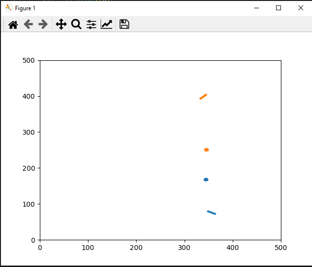

# Collision Avoidance Environment
Basic implementation of a multi agent collision avoidance environment.
The agents have a goal to reach while avoiding colliding with each other. Number of agents, environment size and more can be set. A fixed state can be selected during the reset of the environment. The agent cannot leave the environment, however reaching the border does not make them crash.

## Environment Config
A dict contraining one or more of the following keys and corresponding values can be passed as config during environment initilization.

| Key | Base Value | Description |
|------------------|------------------|------------------|
| num_agents     | 2     | Number of agents     |
| render_mode     | None     | Set to 'human' for vizualisation     |
| environment_size | 500 | Size of the map the agents act on |
| max_timesteps | 1000 | Number of timesteps the agents can take before environment terminates |
| target_reached_threshold | 1 | How far the agent can be from the goal for it to count as reached |
| agent_width | 5 | Width of the agents used in the environment |
| agent_length | 20 | Length of the agents used in the environment |

## Setting an initial state
To use a (semi) fixed state the reset function has to be passed a dict of the form {'agent_state': agent_state} where agent_state is another dict containing of form {'agent_0': {'position'...}}. Every value is passed as an np.float32 array.
| Key | Example Value | Description |
|------------------|------------------|------------------|
| position     | [250,250]     | Limited by environment_size |
| target     | [250,400]     | Limited by environment_size |
| speed | 5 | [-10,10] range for valid values |
| direction | 0 | Direction the agent faces, [0,360] as valid range |

## Base Rewards
The basic reward function gives a base reward of -0.1 in every step, -1 for causing a collision, +1 for reaching the goal and a value from -0.5 to 0.5 depending on distance traveled towards the goal.

## Action Space
The actions are passed as a np.array of form [direction change, speed change] for every agent, e.g. {'agent_0': np.array([0,0])}

## Example
test.py shows an example of initilizing and running the environment.
